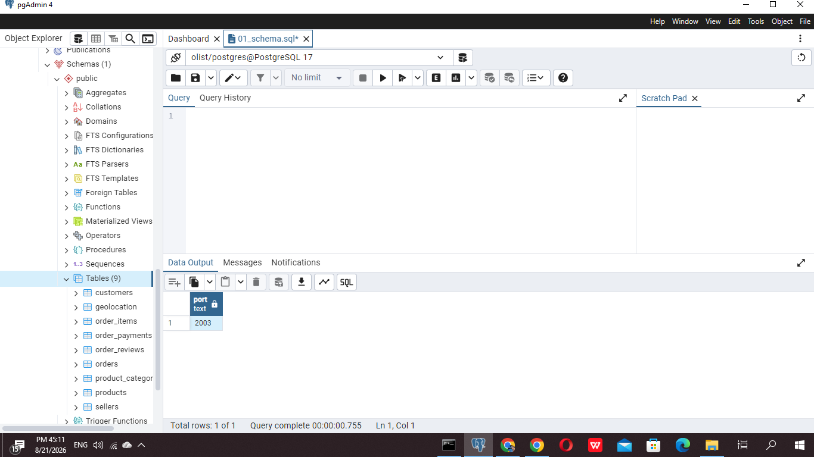
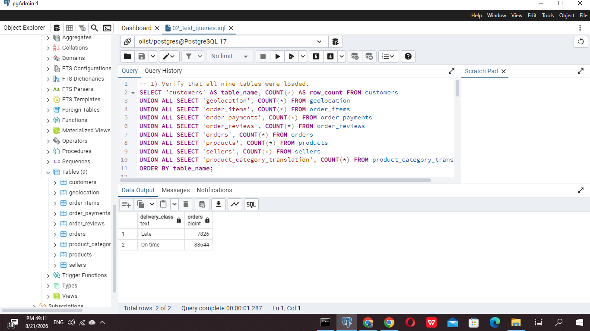
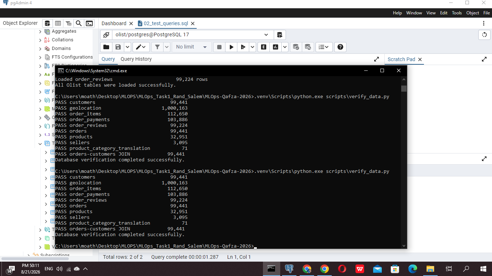

# Task 01 - Olist Database Ingestion

## Objective

Load the Brazilian E-Commerce Public Dataset by Olist into a local PostgreSQL database, define the table relationships, and verify the data using SQL queries, joins, and an automated Python check.

## Tools Used

- PostgreSQL 17
- pgAdmin 4
- Python 3.11
- SQL
- Jupyter Notebook
- VS Code

> This implementation uses the locally installed PostgreSQL server. Docker is not required.

## Project Structure

```text
Task-01/
|-- data/                   # Dataset ZIP location (ZIP is ignored by Git)
|-- notebooks/              # Database verification notebook
|-- screenshots/            # Execution evidence
|-- scripts/
|   |-- load_data.py        # Streams all CSV files from ZIP to PostgreSQL
|   `-- verify_data.py      # Validates counts and the orders-customers join
|-- sql/
|   `-- 01_schema.sql       # Tables, keys, constraints, and indexes
|-- .env.example
|-- requirements.txt
|-- SQL_Queries.sql
`-- README.md
```

## Dataset Tables

| Table | Rows |
|---|---:|
| customers | 99,441 |
| orders | 99,441 |
| order_items | 112,650 |
| order_payments | 103,886 |
| order_reviews | 99,224 |
| products | 32,951 |
| sellers | 3,095 |
| geolocation | 1,000,163 |
| product_category_translation | 71 |

## Main Relationships

- `orders.customer_id` -> `customers.customer_id`
- `order_items.order_id` -> `orders.order_id`
- `order_items.product_id` -> `products.product_id`
- `order_items.seller_id` -> `sellers.seller_id`
- `order_payments.order_id` -> `orders.order_id`
- `order_reviews.order_id` -> `orders.order_id`

`customer_id` identifies the customer record associated with one order, while `customer_unique_id` can identify repeat purchases by the same customer.

## Local Setup

### 1. Create the database

Create a PostgreSQL database named `olist`, then run:

```text
sql/01_schema.sql
```

using pgAdmin Query Tool.

### 2. Add the dataset

Place the original archive at:

```text
data/Brazilian E-Commerce Public Dataset by Olist.zip
```

The archive is intentionally excluded from Git because of its size. The loader reads the CSV files directly from the ZIP.

### 3. Configure the connection

Copy `.env.example` to `.env`, then enter the local PostgreSQL credentials. Never commit `.env`.

```env
POSTGRES_DB=olist
POSTGRES_USER=postgres
POSTGRES_PASSWORD=your_postgresql_password
POSTGRES_HOST=localhost
POSTGRES_PORT=your_postgresql_port
```

### 4. Install dependencies and load the data

```bash
python -m venv .venv
.venv\Scripts\python.exe -m pip install -r requirements.txt
.venv\Scripts\python.exe scripts\load_data.py
```

### 5. Verify the database

```bash
.venv\Scripts\python.exe scripts\verify_data.py
```

Run `SQL_Queries.sql` in pgAdmin to test row counts, two-table and multi-table joins, and the late-delivery target.

## Machine Learning Problem

The future task is **Late Delivery Classification**:

- Late: actual delivery date is later than the estimated delivery date.
- On time: actual delivery date is on or before the estimated delivery date.

```sql
CASE
  WHEN order_delivered_customer_date > order_estimated_delivery_date THEN 1
  ELSE 0
END AS is_late
```

Only delivered orders with known actual delivery dates are labeled. The actual delivery date creates the target and must not be used as a model feature, because that would cause data leakage.

## Execution Results

### PostgreSQL Tables

All nine relational tables were created and loaded successfully.



### SQL Query Results

The target sanity check returned 7,826 late orders and 88,644 on-time orders among 96,470 delivered orders with known actual delivery dates.



### Automated Verification

The verification script confirmed every expected row count and validated the `orders` to `customers` join.



## Task Completion

- [x] PostgreSQL database runs locally.
- [x] All nine Olist CSV files are loaded.
- [x] Primary keys, foreign keys, and indexes are defined.
- [x] SQL queries and joins execute successfully.
- [x] Automated row-count and join verification passes.
- [x] The late-delivery prediction problem and leakage risk are understood.

## Result

Task 1 was completed successfully. The database is ready for the next stages of the MLOps training pipeline.

